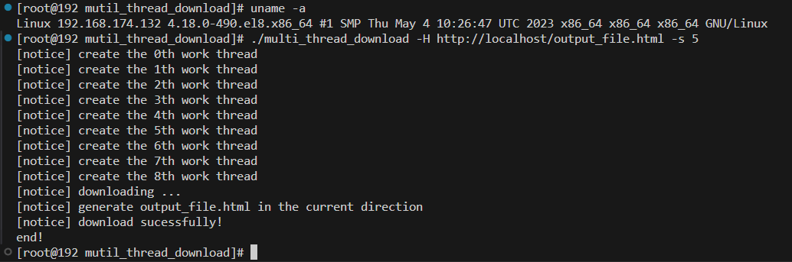

# mutil_thread_download
基于libcurl多线程的HTTP下载，采用模板多态方式，可拓展至FTP下载等其它下载方式。

主要类定义：
Task：下载任务基类
HttpTask：http下载类
SubHttpTask：http下载子类
CThreadPool：模板线程池类，用于根据对应的下载类型，创建下载线程池，通过线程信号量与互斥量实现对共享资源的访问，以及通过调用下载类自定义的RUN函数实现支持不同下载方式；
通过定义FtpTask来实现支持FTP下载。

测试环境：

